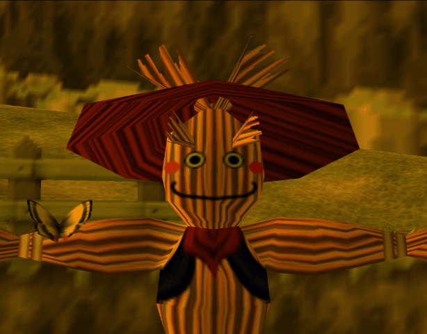
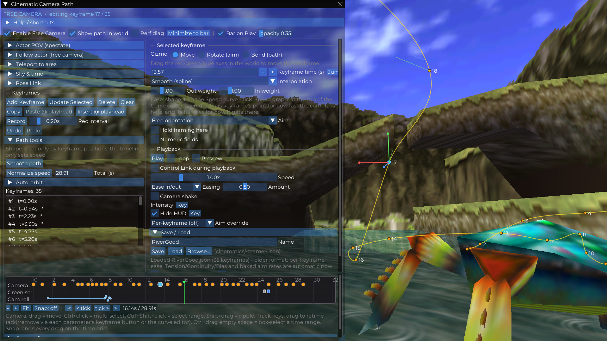
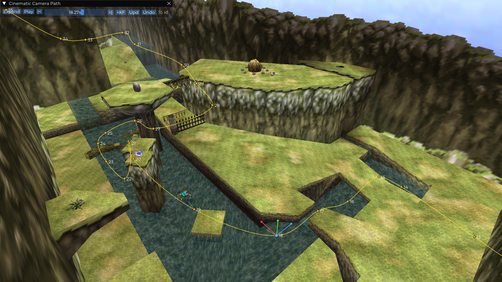
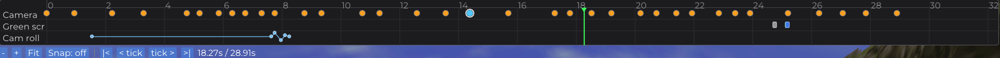
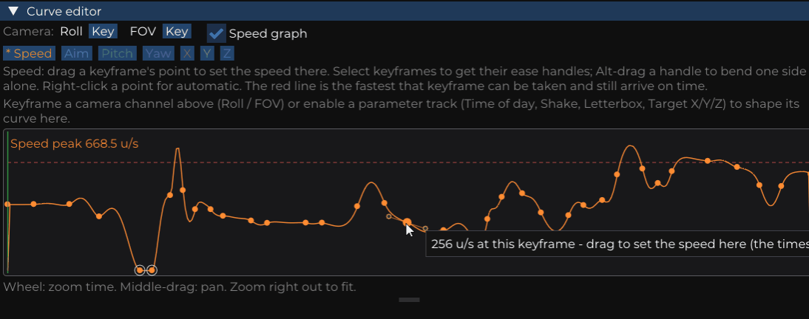
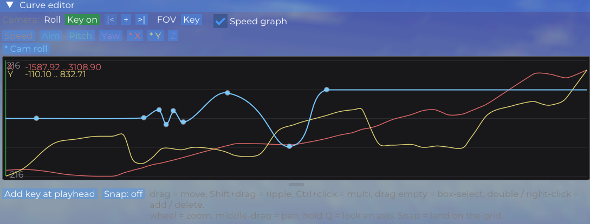
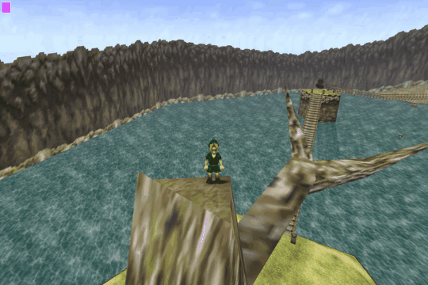
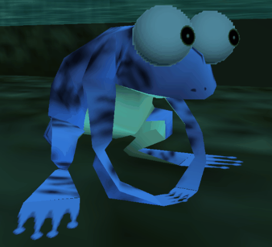
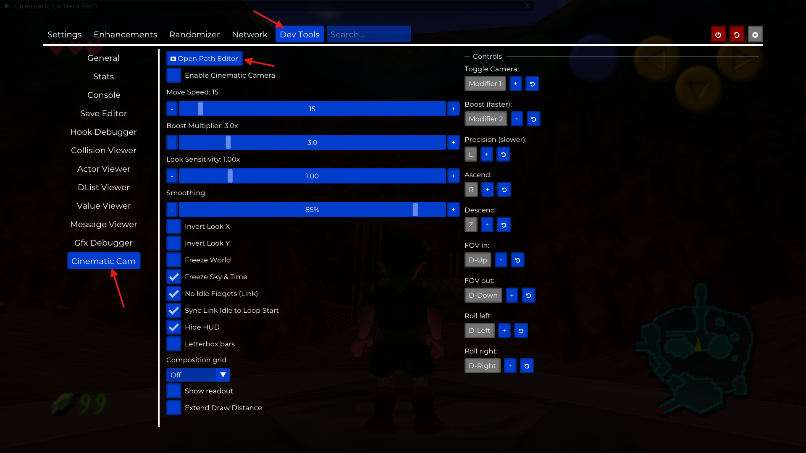
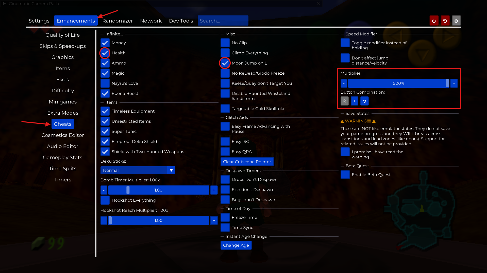

# 🎥 Cinematic Camera for Ship of Harkinian

Welcome ! I've been working on this mod for a while now with the help of Claude Fable and Opus. We've been though many iterations and now it finally feels complete enough to release as a beta. All feedback is more than welcome !
Disclaimer : this PR was first written by claude then edited and re-written by me. All replies will always be written by **me only**

This is a full **cinematic camera toolkit** for [Ship of Harkinian](https://github.com/HarbourMasters/Shipwright) with everything you could need to make cool cinematics in this timeless game. At your disposal, you've got : 

- An easy to use, proper freecam mode
- A full-fledged keyframe and path system, editable in 3D or via the UI
- A timeline, a curve editor and a god damn speed graph

Fly anywhere, frame the shot, drop keyframes, and play back a move that actually looks like it was shot on a
crane rather than snapped between poses.

> **Status : release candidate for 1.0.** The free camera, path editor, curve editor and presentation tools are
> all in and stable. A scripted multi-path **cutscene system** (sequencing + triggers) is the next milestone.

> **📷 Image slot : `docs/media/hero.gif`**
> A 10–15 s loop of a finished move: a slow push-in through a landmark scene, letterbox on, HUD hidden.
> This is the "why you'd want this" shot : it should look like footage, not like a tool.

---

## What's in the box?

### The free camera

A fully detached, controller-driven camera that flies anywhere in the scene, independent of Link.

- **Ignore culling** : actors keep drawing and the far clip plane pushes out while you fly, so nothing pops in
  and out of a shot.
- **Inertia** : full control over how precise/cinematic you want the camera to be.
- **Time control**, Slider for the day/night cycle, time freeze.
- **Boost** and **precision** modifiers to glide through hyrule at light speed.
- Fully rebindable; sticks remap in SoH's normal Controller Configuration. I set my camera toggle to "select"

 

### Keyframes and the path

Fly to a pose, press **Add Keyframe**, repeat. The camera plays a smooth spline through them.

- Each keyframe stores **eye, look-at, roll and FOV**.
- **In-world overlay** : the spline itself, numbered markers, facing indicators and a live playhead, drawn over
  the game at any resolution.
- **Transform gizmos** on the selected keyframe:
  - **Move** : drag the X/Y/Z axes to reposition it.
  - **Rotate (aim)** : drag rings for yaw / pitch / roll.
  - **Bend (path)** : rotate the spline's tangent to bend the curve through the point, without touching the aim.
- **Per-keyframe shape** : Tension / Continuity / Bias, or plain Linear.
- **Numeric fields** for exact position, yaw, pitch, roll and FOV. (they're useful, you'll need 'em)
- **Six aim modes per keyframe**: free orientation, look at a point, look at **Link**, look at **any actor**
  (searchable, distance-sorted picker), look at the **shared movable target**, or **follow the path** like a
  dolly on a rail.
- **Path-level aim override** : re-point an entire recorded flight at one target in a single click.
- **Record from freecam** : not quite like an FPV drone but close enough, you record the path as you move.
- **Smooth path** and **Normalize speed** clean up a hand-built or recorded path in one press. (or just a selection, important)
- **Auto-orbit** : generate a circle or arc of keyframes around Link, an actor, the target or the camera, each
  one already aimed at the centre. And if you wanna record a looped animation, you can even sync link's idle animation to the start of your timeline, to get a perfect loop every 9 seconds

>

>

### The timeline

The physical path's shape comes only from where the keyframes are in the world; the timeline
decides how fast the camera travels between them, and never bends the movement curve. 
Again, all the usual amenities :

- Draggable **keyframe markers** and a draggable **playhead**, with frame and keyframe step buttons.
- **Multi-select** (Ctrl+click), **range select** (Ctrl+Shift+click), **ripple** (Shift+drag), and
  **compress / expand a group** by Alt-dragging either end of a selection.
- **Automation lanes** underneath for every keyframed parameter.
- Type a new **total duration**, or select a span and retime just that span.

### The curve editor

A value-over-time graph for every currently animatable channel : camera roll and FOV, the aim target's X/Y/Z, letterbox,
time of day, shake intensity, green screen.

- **Step / Linear / Smooth / Bezier** per key, with draggable tangent handles on Bezier keys.
- Every enabled channel is drawn at once, each scaled to its own range; the active one is bright and editable.
- **Speed graph** overlay : what the camera actually *does* over the timeline. Drag a keyframe's point to set
  the camera's speed there, and its handles to shape how it accelerates in and out.
- **Precision aids**: hold **Q** while dragging to lock the drag to one axis, and turn on **Snap** to land every
  drag on a grid that refines as you zoom in.

> 
> 

### Watching an actor

- **Actor POV (spectate)** : see the world through any actor's eyes, riding its animated focus point so head bob
  and head turns come through. Tunable eye height; the world keeps running.
- **Follow actor** : attach the free camera to a moving actor and keep your framing relative to it as it goes.
- **Hands-off mode** : the controller plays Link normally while the camera rides the followed actor and keeps
  Link in frame automatically.

> 

### Presentation

- **Hide HUD** while filming.
- **Letterbox bars**, adjustable : 0.12 of the screen each side gives roughly 2.35:1 from 16:9.
- **Composition grid** : rule-of-thirds, 4×4 or 5×5.
- **Green screen** : wanna do a cool transition or simply insert something silly in the sky? you can replace manually or via keyframes the whole skybox by a solid green or blue color. 
- **Camera shake** : smooth handheld jitter, deterministic so it looks the same on every replay, with a
  keyframable intensity you can ramp across a shot.

> **📷 Image slot — `docs/media/presentation.png`**
> One frame with letterbox, the thirds grid and the HUD hidden — ideally a shot you'd actually keep.

> **📷 Image slot — `docs/media/greenscreen.png`**
> A before/after pair, or just the green-screen frame with the sky keyed flat.

---

## Quality of life

Anything i've been used to in other editing softwares and felt the lack of in my workflow :

- **Sky & time** : scrub the time of day directly (with Noon / Sunset / Night presets), or **freeze the sky and
  clock** so clouds stop drifting and the lighting holds still. Essential for a loop that lines up.
- **Are teleport** : Warp to major locations from a built-in dropdown menu.
- **Pose Link** : a dial that turns Link to an exact heading, so he's facing the right way in frame.
- **No idle fidgets** : stop Link stretching and looking around, so he holds a clean standing pose. (not a T-pose, just default idle)
- **Sync Link's idle to the loop** : restart his breathing animation each time the loop wraps, so a looping GIF
  has no visible seam. (timing sensitive)
- **Control Link during playback** : drive Link with the controller while the camera flies its path. Pairs
  naturally with a *Look at Link* aim.
- **Loop styles** : forward with a smooth return leg, or ping-pong. An optional one-frame **loop-start marker**
  flashes in the corner so you can find the exact boundary in a recording and trim there.
- **Save / Load** : paths are JSON in `cinematics/`, with an **autosave** every minute while you have unsaved
  changes. A saved path can **remember where it was shot** and fade-warp you back there on load.
- **Undo / redo** throughout, plus **copy / paste** and **insert a keyframe at the playhead**.
- **Shooting bar** : Minimized play bar at the top of the screen while the shot is playing, no UI clutter.
- **Window opacity** : fade the editor so the game reads through it. (life changer on single monitor setups)

---

## Getting started 

1. Open the menu → **Dev Tools** → **Cinematic Cam**.
2. Turn on **Enable Cinematic Camera** (or bind it to a button, see Controls).
3. Click **Open Path Editor**.
4. I highly recommend going to the enhancements > cheats tab and turning on infinite health and noclip on L, along with speed modifier

### My workflow

1. **Toggle** the free camera, fly to the opening shot.
2. **Add Keyframe**, or hit **Record** and fly the whole move live.
3. Build a few more. Adjust each with the **move / rotate / bend** gizmos or the numeric fields.
4. Set the **aim** per keyframe, or point the whole path at one thing with the **aim override**.
5. **Play.** Retime on the timeline, shape the acceleration on the **speed graph**, add **easing** and **loop**.
6. Turn on **letterbox**, **hide HUD** and the **composition grid** for the final framing, then capture.
7. **Save** it by name, it lands in `cinematics/<name>.json`.

---

## 🎮 Controls

Movement and look are the analog sticks (remap them in **Controller Configuration**). The button actions below
live in **Dev Tools → Cinematic Cam → Controls** and are all rebindable.

| Action | Default |
| --- | --- |
| Move / strafe | Left stick (up = forward) |
| Look (yaw / pitch) | Right stick |
| Toggle camera | Modifier 1 *(map it to Select/Back)* |
| Boost (faster) | Modifier 2 *(map it to RB)* |
| Precision (slower) | L |
| Ascend | R |
| Descend | Z |
| FOV in / out | D-pad ↑ / ↓ |
| Roll left / right | D-pad ← / → |

> **Modifier 1 and Modifier 2 do nothing until you assign them**, they are SoH's two spare buttons, not
> real N64 ones. Map them once in **Settings → Controller Configuration → your port → Modifier
> Buttons**: M1 to Select/Back, M2 to your right bumper. They're used here because the toggle has to be
> safe to press during normal gameplay, and boost has to be holdable while both sticks are busy.

### Keyboard, with the path editor focused

| Key | Action |
| --- | --- |
| `Space` | Play / stop |
| `,` `.` | Step back / forward one tick |
| `[` `]` | Previous / next keyframe |
| `K` | Add a keyframe at the current pose |
| `Del` | Delete the selection |
| `Ctrl` + `A` | Select every keyframe |
| `Ctrl` + `Z` / `Ctrl` + `Y` | Undo / redo |

### Mouse, in the timeline and the curve editor

| Input | Action                                              |
| --- |-----------------------------------------------------|
| Drag | Move a keyframe                                     |
| `Ctrl` + click | Add / remove from the selection                     |
| `Ctrl` + `Shift` + click | Select a range                                      |
| `Shift` + drag | Ripple : push this keyframe and everything after it |
| `Alt` + drag a selection's end | Compress / expand the group                         |
| Hold `Q` while dragging | Lock the drag to one axis                           |
| Wheel / middle-drag | Zoom time / pan                                     |
| Double-click / right-click *(curve editor)* | Add / delete a key                                  |
| `Alt` + drag a handle | Break the handle pair and bend one side alone       |

---

## ⚙️ Settings

Everything lives under **Dev Tools → Cinematic Cam** (CVars: `gEnhancements.CinematicCam.*`).

- **Move Speed**, **Boost Multiplier**, **Look Sensitivity**, **Smoothing**, **Invert Look X / Y**
- **Freeze World**, **Freeze Sky & Time**, **No Idle Fidgets**, **Sync Link Idle to Loop Start**
- **Hide HUD**, **Letterbox bars** (+ size), **Composition grid**, **Show readout**
- **Extend Draw Distance** (+ multiplier) and **Far Clip Plane**
- **Controls** : per-action button bindings

---

## 🗺️ Roadmap

- **Cutscene system** : a path library, **sequenced shots** (several paths back to back with cuts and fades),
  and **triggers** that fire a cinematic on a game event: entering a room, a flag being set, talking to an
  actor, walking into a region. That's the step that turns this from a capture tool into something modders can
  ship inside a mod.
- Transitions and crossfades, and per-shot actions (sound, text, fade).

---

## 📝 Notes

- Actor references in Look-at, Spectate and Aim-override are tracked live and re-acquired by id, so they survive
  an actor instance being replaced; saved paths re-find their actor by id within the same scene.
- Actor POV uses position, facing and the animated focus point. OOT actors don't expose a general head-bone
  orientation, so head *tilt* won't always carry through.
- Nothing in the editor auto-saves over your work: edits live in memory until you press **Save**, and the
  once-a-minute autosave writes to a separate `<name>_autosave.json`.

---

## 🧱 Building

This ships as part of the SoH fork : build SoH normally (see [`docs/BUILDING.md`](../../../docs/BUILDING.md))
and the cinematic camera is compiled in automatically.

*Built for the Ship of Harkinian community. 🚢*
